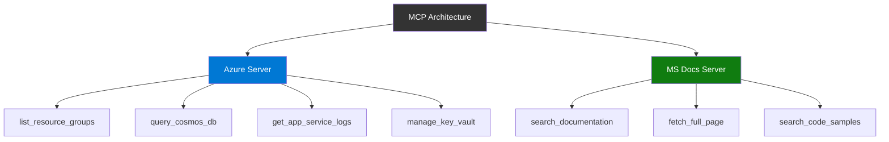

# MCP Server Tools Visualization

Explore available MCP server tools and capabilities.

## Azure MCP Server

- `list_resource_groups`
- `query_cosmos_db`
- `get_app_service_logs`
- `manage_key_vault`

## Microsoft Docs MCP Server

- `search_documentation`
- `fetch_full_page`
- `search_code_samples`

## Architecture Diagrams

